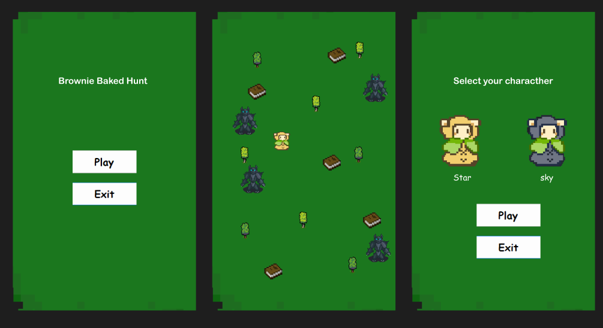

# Brownie Baked Hunt 🍫🐺

A mini OOP-based C# Windows Forms game where players collect brownies while avoiding wolves. Built using object-oriented programming principles including encapsulation, inheritance, polymorphism, abstraction, and interfaces.

---

## Features

- Play as one of two characters: **Sky** or **Star**
- Collect 10 brownies to win
- Avoid enemy wolves
- Restart the game after losing or winning
- Polished UI with custom sprites

---

## Object-Oriented Principles Used

| OOP Concept     | How It’s Applied                                      |
|------------------|--------------------------------------------------------|
| **Class & Object** | `Character`, `Wolf`, `BrownieItem` classes instantiated via `new` |
| **Encapsulation** | Variables like `health`, `score`, and logic hidden inside methods |
| **Inheritance**   | `Wolf` and `Character` can inherit from a shared base class |
| **Polymorphism**  | `Move()` method behaves differently in `Character` vs `Wolf` |
| **Abstraction**   | Abstract classes/interfaces used for movable or drawable entities |

---

## UI Preview

*Gameplay: Collect brownies and avoid wolves*

---

## How to Run the Project

1. Clone this repository or download the `.zip`  
2. Open with Visual Studio (recommended: 2022 or newer)
3. Make sure your `.NET 8.0` Windows target is installed
4. Build and Run the solution

---

## Project Structure

BrownieBakedHunt/
│
├── Brownie/
│ ├── GameObjects/
│ │ ├── Character.cs
│ │ ├── Wolf.cs
│ │ ├── BrownieItem.cs
│ │ └── IMovable.cs (Interface)
│ ├── GameForm.cs
│ ├── MainForm.cs
│ └── Program.cs
│
├── Resources/
│ ├── Sky.png
│ ├── Star.png
│ ├── Wolf.png
│ ├── Brownie.png
│ └── ...

## 💡 Future Improvements

- Add player health and lives
- Sound effects and background music
- High score saving system
- Custom level maps or difficulty levels

---

## 📚 Credits

- Developed by: **Berlian Yafi**
- Supported by: 180 Degrees Consulting @ ITS
- Sprites: Created or sourced from free game asset libraries

---

## 🧁 Play responsibly and don’t get caught by the wolves!